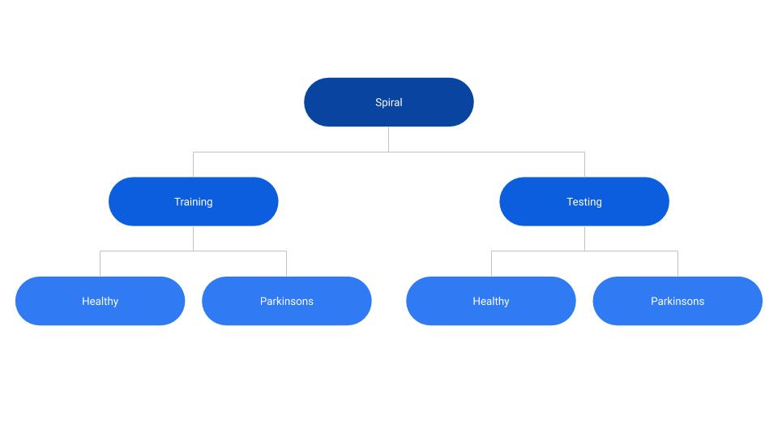
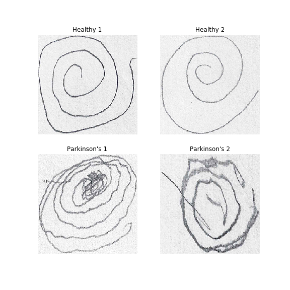
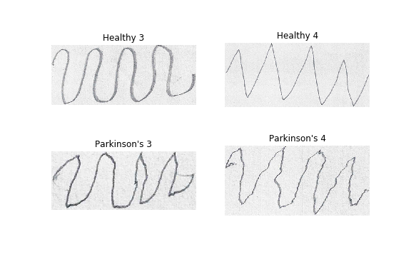
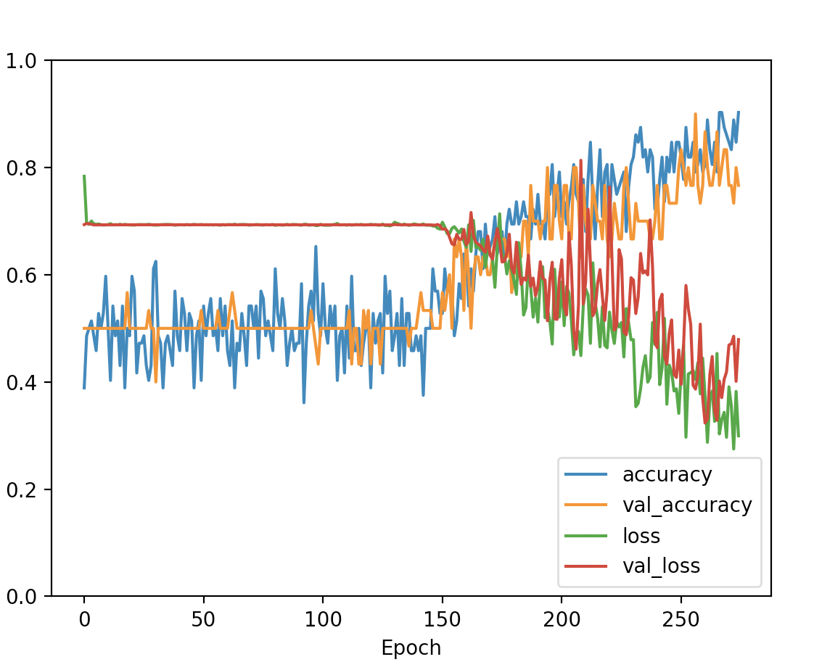

# Parkinson's Disease Kinetic Tremor Diagnostic Image Classification Capstone


## Background
Parkinson's Disease is a condition characterized by symptoms related to movement such as tremor, rigidity, bradykinesia, and imbalance to name a few. Handwriting and simple drawing tests may aid in the diagnosis and characterization of early parkinson's disease. However, these tests often need the interpretation of an expert. The images used in this project come from a [kaggle dataset](https://www.kaggle.com/kmader/parkinsons-drawings) inspired by a study done by [Zham et al.](https://www.frontiersin.org/articles/10.3389/fneur.2017.00435/full) published in Frontiers of Neurology. Image classification and recognition models may aid in the efficiency and accuracy of diagnosing early Parkinson's Disease.

## Objective(s)
* Build and train a convolution neural network that can accurately classify an image as being drawn by either **a)** a healthy patient or **b)** a patient with Parkinson's Disease

## Image Data: Acquisition and EDA
* Images were organized as so:


###### Figure 1: Parent Directory 'Spiral' was split into 2 folders: 'training' and 'testing', each containing folders of images labeled as either 'healthy' or 'Parkinsons'

The 'training, healthy' -labeled folder contained 36 images with the 'training, Parkinsons' - labeled folder also containing 36 images.
The 'testing, healthy' - labeled folder contained 15 images and the 'testing, Parkinsons' - labeled folder also containing 36 images.

* An example of the raw spiral images: 


###### Figure 2: The top row of images are spiral drawings done by healthy patients; the bottom row of images are spiral drawings done by patients with Parkinson's Disease

* An example of the raw wave images:


###### Figure 3: The top row of images are wave drawings done by healthy patients; the bottom row of images are wave drawings done by patients with Parkinson's Disease


## Convolutional Neural Network
* Binary image classification 
  * Detect if image was drawn from either **a)** Healthy or **b)** Parkinsons patient
* The spiral drawing convolutional neural network (CNN) model had the following architecture:
```
_________________________________________________________________
Layer (type)                 Output Shape              Param #   
=================================================================
conv2d (Conv2D)              (None, 254, 254, 32)      896       
_________________________________________________________________
activation (Activation)      (None, 254, 254, 32)      0         
_________________________________________________________________
max_pooling2d (MaxPooling2D) (None, 127, 127, 32)      0         
_________________________________________________________________
conv2d_1 (Conv2D)            (None, 125, 125, 32)      9248      
_________________________________________________________________
activation_1 (Activation)    (None, 125, 125, 32)      0         
_________________________________________________________________
max_pooling2d_1 (MaxPooling2 (None, 62, 62, 32)        0         
_________________________________________________________________
conv2d_2 (Conv2D)            (None, 60, 60, 32)        9248      
_________________________________________________________________
activation_2 (Activation)    (None, 60, 60, 32)        0         
_________________________________________________________________
max_pooling2d_2 (MaxPooling2 (None, 30, 30, 32)        0         
_________________________________________________________________
conv2d_3 (Conv2D)            (None, 28, 28, 32)        9248      
_________________________________________________________________
activation_3 (Activation)    (None, 28, 28, 32)        0         
_________________________________________________________________
max_pooling2d_3 (MaxPooling2 (None, 14, 14, 32)        0         
_________________________________________________________________
conv2d_4 (Conv2D)            (None, 12, 12, 64)        18496     
_________________________________________________________________
activation_4 (Activation)    (None, 12, 12, 64)        0         
_________________________________________________________________
max_pooling2d_4 (MaxPooling2 (None, 6, 6, 64)          0         
_________________________________________________________________
flatten (Flatten)            (None, 2304)              0         
_________________________________________________________________
dense (Dense)                (None, 500)               1152500   
_________________________________________________________________
activation_5 (Activation)    (None, 500)               0         
_________________________________________________________________
dropout (Dropout)            (None, 500)               0         
_________________________________________________________________
dense_1 (Dense)              (None, 1)                 501       
_________________________________________________________________
activation_6 (Activation)    (None, 1)                 0         
=================================================================
Total params: 1,200,137
Trainable params: 1,200,137
Non-trainable params: 0
_________________________________________________________________
```



###### Figure 4: Evaluation of the spiral model in which 275 epochs were run. Around 160 epochs in was when true improvements were seen in the model's ability to learn and classify images of spiral drawings.


## Challenges
  * The primary challenge I faced with this dataset was having very few images to trian/test on
    * How it was resolved: Data augmentation methods were used to circumvent this challenge. An image generator takes in the few images of the dataset and alters      them by various transformations such as rotating them, shifting height/width, changing brightness, etc. so that the model sees new images each time and          prevents overfitting
   
## Potential Applications
* Apps that may be able to take in a snapshot image of a spiral or wave drawn by a patient that may be used in clinics or pharmacies for patients who suspect they may have early signs of Parkinson's Disease

## Future Studies
