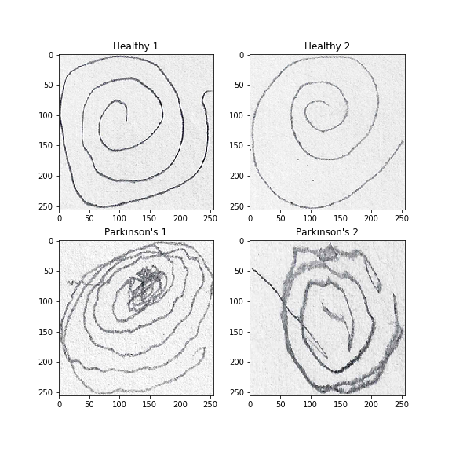

# Parkinson's Disease Kinetic Tremor Diagnostic Image Classification Capstone

## Background
Parkinson's Disease is a condition characterized by symptoms related to movement such as tremor, rigidity, bradykinesia, and imbalance to name a few. Handwriting and simple drawing tests may aid in the diagnosis and characterization of early parkinson's disease. However, these tests often need the interpretation of an expert. The images used in this project come from a [kaggle dataset](https://www.kaggle.com/kmader/parkinsons-drawings) inspired by a study done by [Zham et al.](https://www.frontiersin.org/articles/10.3389/fneur.2017.00435/full) published in Frontiers of Neurology. Image classification and recognition models may aid in the efficiency and accuracy of diagnosing early Parkinson's Disease.

## Objective(s)
* Build and train a convolution neural network that can accurately classify an image as being drawn by either **a)** a healthy patient or **b)** a patient with Parkinson's Disease

## Image Data: Acquisition and EDA
* Images were organized as so:

###### Figure 1: Parent Directory 'Spiral' was split into 2 folders: 'training' and 'testing', each containing folders of images labeled as either 'healthy' or 'Parkinsons'

The 'training, healthy' -labeled folder contained 36 images with the 'training, Parkinsons' - labeled folder also containing 36 images.
The 'testing, healthy' - labeled folder contained 15 images and the 'testing, Parkinsons' - labeled folder also containing 36 images.

* A sample of the raw image data looked like this: 

###### Figure 2: The top row of images are spiral drawings done by healthy patients; the bottom row of images are spiral drawings done by patients with Parkinson's Disease

## Convolutional Neural Network

## Challenges
* Small dataset
* A Convolutional Neural Network that refuses to learn
  * An issue that I encountered was with a training accuracy score that typically ranged from 0.4 to 0.5...almost consistently sometimes on 0.5.
  
## Potential Applications
* Apps that may be able to take in a snapshot image of a spiral or wave drawn by a patient that may be used in clinics or pharmacies for patients who suspect they may have early signs of Parkinson's Disease

## Future Studies
