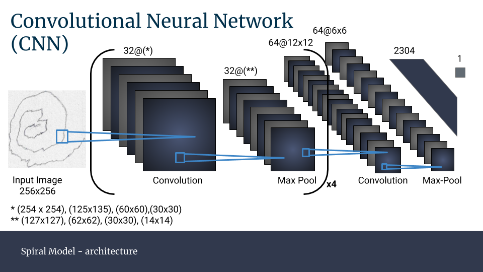
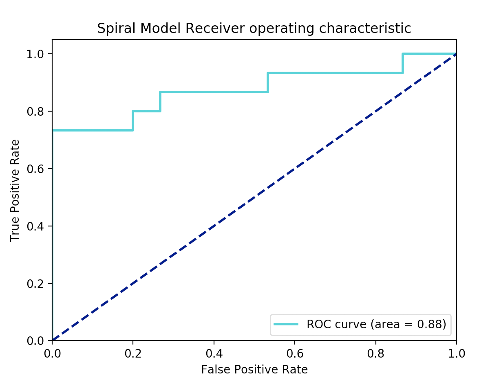
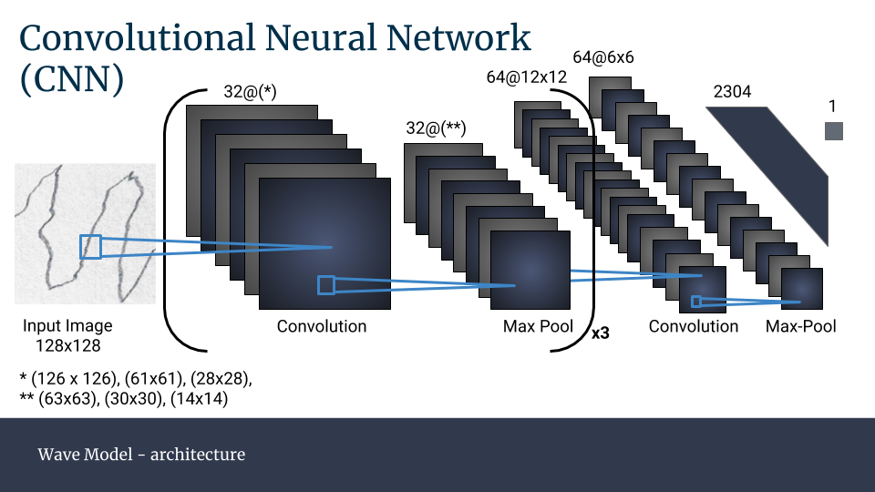
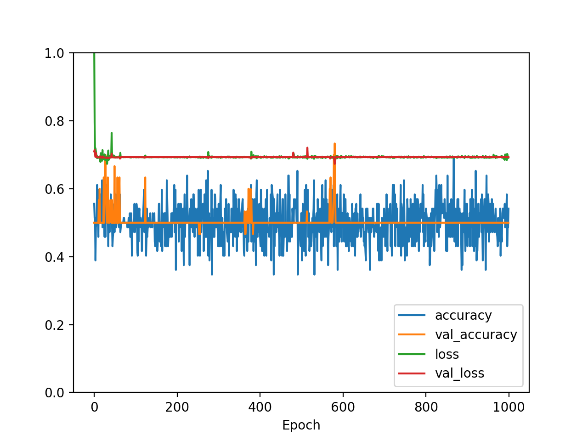
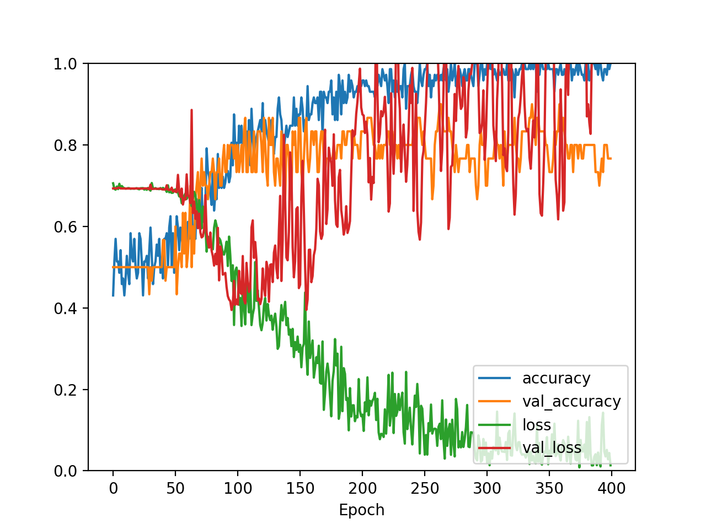
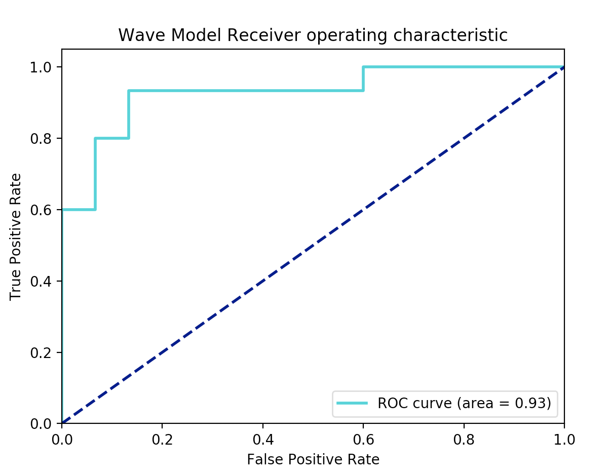

# E.P.I.C: Early Parkinson's Image Classification


## Background
Parkinson's Disease is a condition characterized by symptoms related to movement such as tremor, rigidity, bradykinesia, and imbalance to name a few. Handwriting and simple drawing tests may aid in the diagnosis and characterization of early parkinson's disease. However, these tests often need the interpretation of an expert. The images used in this project come from a [kaggle dataset](https://www.kaggle.com/kmader/parkinsons-drawings) inspired by a study done by [Zham et al.](https://www.frontiersin.org/articles/10.3389/fneur.2017.00435/full) published in Frontiers of Neurology. Image classification and recognition models may aid in the efficiency and accuracy of diagnosing early Parkinson's Disease.

## Objective
* Build and train a convolution neural network that can accurately classify an image as being drawn by either **a)** a healthy patient or **b)** a patient with Parkinson's Disease

## Image Data: Acquisition and EDA
* The **spiral** image dataset (and similarily the **waves** image dataset) was organized in the following way:


###### Figure 1: Parent Directory 'Spiral' was split into 2 folders: 'training' and 'testing', each containing folders of images labeled as either 'healthy' or 'Parkinsons'. 'Waves' was also split in the same format.


* **Spiral** Dataset
  * Training set: 36 Healthy, 36 Parkinson's
  * Testing set: 15 Healthy, 15 Parkinson's
* **Wave** Dataset
  * Training set: 36 Healthy, 36 Parkinson's
  * Testing set: 15 Healthy, 15 Parkinson's
* I decided to create separate CNN models for spiral images and wave images
* An example of the raw spiral images: 


###### Figure 2: The top row of images are spiral drawings done by healthy patients; the bottom row of images are spiral drawings done by patients with Parkinson's Disease

* An example of the raw wave images:


###### Figure 3: The top row of images are wave drawings done by healthy patients; the bottom row of images are wave drawings done by patients with Parkinson's Disease

* The raw images for both datasets needed no preprocessing, they were ripe for immediate model-use for the following reasons:
  * Although technically having 3 color channels, the images had enough contrast between the pencil markings and the white background upon which they were drawn 
  * All spiral images had the same image dimensions of ```image_width, image_height = 256, 256```. However, the wave images had slight variation in image             dimensions but for the purposes of my model, I was able to resize images within the ```ImageDataGenerator()``` to ```image_width, image_height = 128, 128```

## Convolutional Neural Networks
* Binary image classification 
  * Detect if image was drawn from either **a)** Healthy or **b)** Parkinsons patient
  
#### Spiral Model:
* The **spiral** CNN model had the following architecture and trainable parameters:



```
Total params: 1,200,137
Trainable params: 1,200,137
Non-trainable params: 0
_________________________________________________________________
```

*The model was built with 4 repeating layers of convolution and max-pooling layers with 32 filters followed by a 64 filter convolution and max-pooling layer, a flatten, dense layer and output
* Figure 4 shows how the final version of my spiral model performed with 275 epochs. Around 160 epochs in was when true improvements were seen in the model's ability to learn and classify images of spiral drawings.
* Figure 5 shows the ROC curve of the model's performance with an AUC of 0.88
* A True positive reperesents a scenario in which an input image is truly labeled as "Parkinson's" and the model's classification was also  "Parkinson's". 
* A False positive represents a scenario in which an input image is truly labeled "Healthy" and the model classifies is as "Parkinson's"


###### Figure 4: Evaluation of the spiral model in which 275 epochs were run. 



###### Figure 5: ROC curve of the final version of the spiral model. 

#### Waves Model:

* The **waves** CNN model had the following architecture and trainable parameters:



```
Total params: 1,190,889
Trainable params: 1,190,889
Non-trainable params: 0
```

* The evaluation plot (Figure 6) of the **wave** model had 2 less convolution layers than what the model summary above shows. This version of the model did poorly as it had a general training accuracy around 0.5, validation loss and training loss that remained fairly constant at 0.7, and a validation accuracy that remained constant around 0.5. 
* The second version of the **wave** model (Figure 7) had 1 less convolution layer than what the model summary shows above. This version of the model is ultimately what did very well as demonstrated by the rapid increases in both training accuracy and validation accuracy at around 75 epochs. The training loss started to decrease rapidly after 75 epochs as well.
* The second version of the **wave** model was run again with increased epochs (400 --> 750) and had improved accuracy (90% compared to 77%). The corresponding ROC curve for this version 2.5 of the **wave** model can be found in Figure 8. 



###### Figure 6: Evaluation of the waves model in which 1,000 epochs were run and had 2 less convolution layers than the starting model



###### Figure 7: Evaluation of the waves model in which 400 epochs were run and had 1 less convolution layer than the starting model.



###### Figure 8: ROC evaluation of the final version of the wave model. AUC = 0.93

## Challenges
  * The primary challenge I faced with this dataset was having very few images to trian/test on
    * How it was resolved: Data augmentation methods were used to circumvent this challenge. An image generator takes in the few images of the dataset and alters      them by various transformations (i.e. rotation, zoom, flips, etc.) so that the model sees new images each time and prevents overfitting
   
## Potential Applications
* Apps that may be able to take in a snapshot image of a spiral or wave drawn by a patient that may be used in clinics or pharmacies for patients who suspect they may have early signs of Parkinson's Disease, family history of Parkinson's, or are taking medications that may cause Parkinson-like symptoms.
* If used in a pharmacy setting, a potential application of this could be in flagging patients who are taking medications commonly known to cause parkinsonism-like symptoms. These flagged patients can then be monitored and asked to perform the simple drawing test at their local pharmacy or local clinic to get acces to care earlier rather than later.

## Future Studies
* Combine models to take in both spiral and wave images at the same time
* Continue to improve efficiency and accuracy of the current spiral and wave models. 
